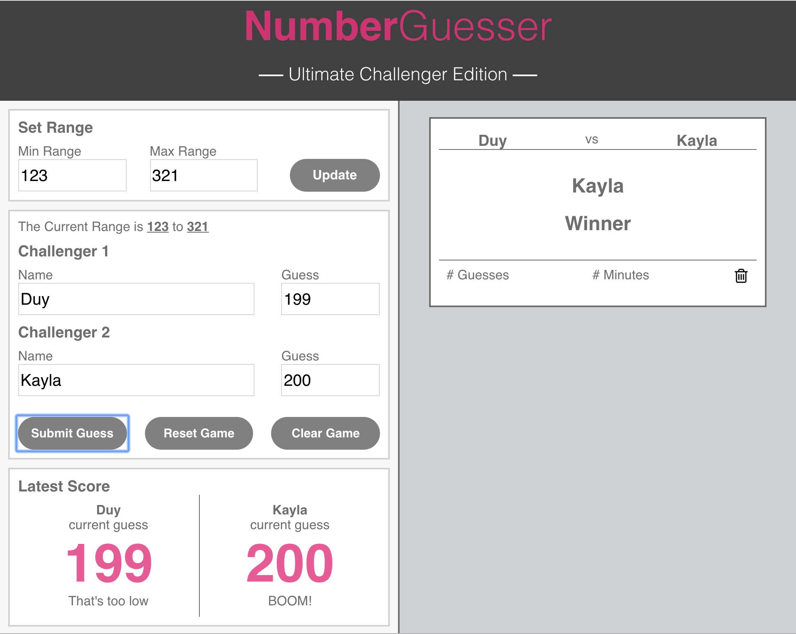
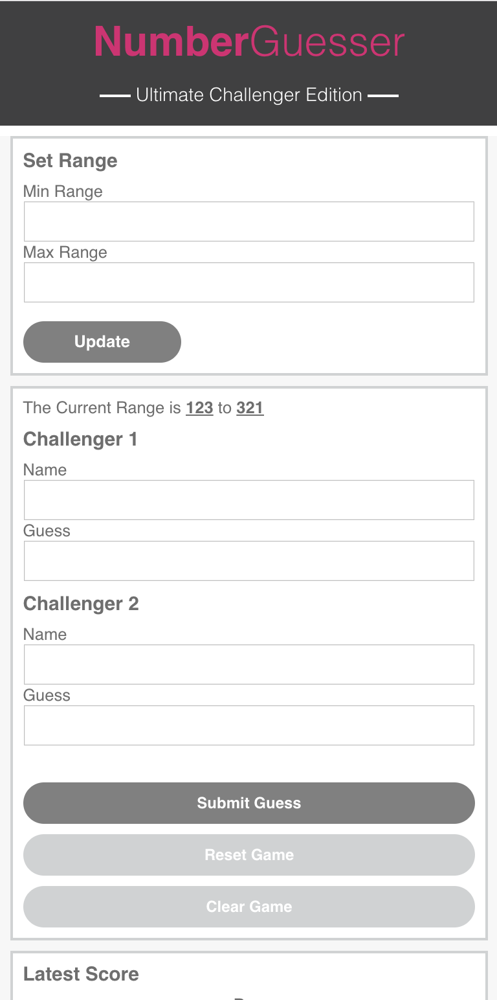

# Number-Guesser-Duy & Kayla 

The object of Number Guesser was for two people to work together and create a game that interacts with two players. 

The game unload populates a range for you to go ahead and start without having to set a minimum and maximum range. 
You will see that you have the option to pick your own min and max for further interaction with the game.

If you choose not to pick a range the range of the game is preset from 1-100. Also, on load the game will pick a random 
number between 1-100  for you start playing. 

If the users choose to set their own range, they absolutely can. 

Moving further into the game you have challenger one and challenger two allowing your users to place
their names and their guesses. There are four buttons for the 1st part of the game. 

The Update button, allows the users to place their own range. The functionality within javascript communicates the 
new range within the element ‘.current-min’ and ‘.current-max’.

Super fun and  cool. 

Things get even cooler,  if your players guesses are too high, too low, or the correct number they will see just that in the player stats section of the game. Even further, if they guessed the correct number they get a player winner card that displays itself. 

## My-Project

## Responsiveness

